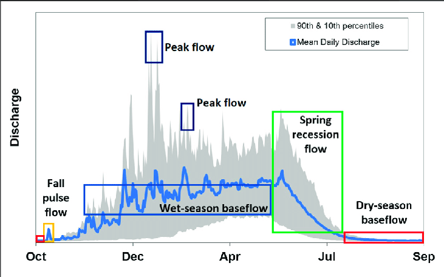

```{r setup, include=FALSE}
knitr::opts_chunk$set(echo = TRUE)
library(tidyverse)

```

# Incorperating EFF into R2R

The Reorienting to Recovery Structured Decision Making group proposed a effective functional flow (EFF) scenario. To this date, there is no available CalSIM EFF run so we cannot model full EFF on the entire system. This document outlines our approach to piloting a EFF on the Sacramento River.

**Pilot EFF Approach on the Sacramento River**

The R2R technical team is working collaboratively with a flow sub group to develop a EFF hydrograph for the Sacramento River. We are building off of the Nature Conservancy's Natural Flows Database to develop a wet and dry year monthly EFF hydrographs. We will compile these wet and dry year EFF into a 20 year synthetic timeserries based on the historical water year types between 1980 and 2000, the current R2R model timeframe.

**Planned Improvements and Next Steps**

\*\*Something about Pulse Flow Logic to expand models capacity to tune into flow, increasing granularity of flow related effects despite a monthly timestep.

\*\* Create EFF calsim Run

## What is a EFF?

California's EFF include 5 distinct components of a natural flow regime: fall pulse flows, wet season peak flows, wet season base flows, spring recession flows, and dry season baseflows.

{width="542"}

For more information on EFF please refer to additional sources:

-   [Modeling Functional Flows in California's Rivers](https://www.frontiersin.org/articles/10.3389/fenvs.2022.787473/full#:~:text=Functional%20flow%20components%20in%20California,ecological%20processes%20in%20riverine%20ecosystems.)

-   [California Environmental Flows Framework](https://ceff.ucdavis.edu/sites/g/files/dgvnsk5566/files/media/documents/CEFF%20Technical%20Report%20Ver%201.0%20Mar_31_2021_DRAFT_FINAL%20for%20web.pdf)

-   [Natural Flows Database](https://ceff.ucdavis.edu/sites/g/files/dgvnsk5566/files/media/documents/CEFF%20Technical%20Report%20Ver%201.0%20Mar_31_2021_DRAFT_FINAL%20for%20web.pdf)

## How can we tailor EFF to our system

EFF are hypothesized to be the best flows for salmon in our historical system. However, our system is highly managed so we may need to alter EFF slightly from their historical values to maximize benefit to salmon.

The R2R techncial team developed proposed EFF monthly flows by combining the [Natural Flows Database](https://ceff.ucdavis.edu/sites/g/files/dgvnsk5566/files/media/documents/CEFF%20Technical%20Report%20Ver%201.0%20Mar_31_2021_DRAFT_FINAL%20for%20web.pdf) values with critical flow to survival migratory thresholds on the Sacramento River (from [Michel 2021](https://esajournals.onlinelibrary.wiley.com/doi/full/10.1002/ecs2.3498)).

```{r, echo=FALSE}
compare_total_flow_volumne <- function(calsim_flows, natural_flow_flows, proposed_eff){
  all_flows <- bind_rows(calsim_flows |> mutate(type = "calsim"), 
                         natural_flow_flows |> mutate(type = "Natural flows Database flows"),
                         proposed_eff |> mutate(type = "Proposed Model EFF")) |> 
    select(month, flow_cfs, type) |> 
    mutate(acre_ft_per_month = flow_cfs * 60.3707) |> #TODO confirm conversion 
    group_by(type) |> 
    summarise(annual_acre_feet = sum(acre_ft_per_month)) |> 
    rename(Scenario = type, "Annual Acre Ft Water" = annual_acre_feet) 
  
  return(knitr::kable(all_flows))
    
}

```

### Wet Year EFF

```{r}
# WET YEAR EFF 
# NATURAL FLOWS TOOL COMID: 2851441

# For calsim flow picked wet year, wettest year on reccord 
# TODO find average wet year 
wet_year <- DSMflow::flows_cfs$biop_itp_2018_2019 |> 
  select(date, flow_cfs = `Upper-mid Sacramento River`) |> 
  filter(year(date) == 1996) |>
  mutate(water_year = as.Date(ifelse(month(date) %in% 10:12, 
                             date,
                             as.Date(paste0(year(date) + 1, "-", month(date), "-", day(date))))),
         month = factor(month.abb[month(date)], levels = month.abb[c(10, 11, 12, 1:9)])) |>
  glimpse() 
wet_year |> 
  ggplot(aes(x = water_year, y = flow_cfs)) + 
  geom_line()

sac_wet_natural_flows_database_eff <- tibble(month = factor(month.abb[1:12], 
                                                        levels = month.abb[c(10, 11, 12, 1:9)]),
                                        flow_cfs = c(62000, 48900, 43200,
                                                     37300, 19200, 9270,
                                                     3140, 1680, 1280, 
                                                     3760, 11600, 30000))

# Build Functional flow curve 
sac_functional_flows_for_model_wet <- tibble(month = factor(month.abb[1:12], 
                                                        levels = month.abb[c(10, 11, 12, 1:9)]),
                           # month_name = month.abb[month],
                           flow_cfs = c(62000, # Jan Wet season base flow + Peak Magnitude flows, based on wet year monthly Natural Flows 
                                        62000, # Feb Wet season base flow + Peak Magnitude flows, based on wet year monthly Natural Flows 
                                        35000, # March Wet season base flow, based on wet year monthly Natural Flows 
                                        35000, # April Wet season base flow, based on wet year monthly Natural Flows 
                                        10700, # May Spring recession flow (10,700 for mig surv ~50%)
                                        10700, # June Spring recession flow (10,700 for mig surv ~50%)
                                        7500, # July half way between dry season baseflow and mig surv 50% threshold
                                        4308, # Aug - dry season baseflow 1 (keep migratory surv at ~20%), 
                                        1280, # Sept - All fall runs juves have left system, use Natural Flows dry season base flow
                                        3760, # oct - dry season baseflow, add some pulse flow in 
                                        11600, # Nov add fall pulse flow, based on wet year monthly Natural Flows
                                        35000 # Dec Begin wet season baseflow and medium flow, based on wet year monthly Natural Flows
                                         )) |> glimpse()

# write_csv(functional_flows, "functional_flows_wet_year.csv")

sac_functional_flows_for_model_wet |> 
  ggplot(aes(x = month, y = flow_cfs, group = 1)) + 
  geom_line(color = "lightblue") + 
  geom_line(data = sac_wet_natural_flows_database_eff, 
            aes(x = month, y = flow_cfs, group = 1), color = "gray") +
  geom_line(data = wet_year, aes(x = month, y = flow_cfs), color = "black") +
  theme_minimal() + 
  labs(x = "Month", 
       y = "Flow CFS", 
       title = "Wet Year - Model Functional Montly Flows")


```

```{r}
compare_total_flow_volumne(wet_year, 
                           sac_wet_natural_flows_database_eff,
                           sac_functional_flows_for_model_wet)

```

### Dry Year EFF

<div>

```{r}
# DRY YEAR EFF 
# Dry Years 
dry_year <- DSMflow::flows_cfs$biop_itp_2018_2019 |> 
  select(date, flow_cfs = `Upper-mid Sacramento River`) |> 
  filter(year(date) == 1987) |>
    mutate(water_year = as.Date(ifelse(month(date) %in% 10:12, 
                             date,
                             as.Date(paste0(year(date) + 1, "-", month(date), "-", day(date))))),
         month = factor(month.abb[month(date)], levels = month.abb[c(10, 11, 12, 1:9)])) |>
  glimpse() 
dry_year |> 
  ggplot(aes(x = month, y = flow_cfs, group = 1)) + 
  geom_line()

sac_dry_natural_flows_database_eff <- tibble(month = factor(month.abb[1:12], 
                                                        levels = month.abb[c(10, 11, 12, 1:9)]),
                                        flow_cfs = c(14100, 15700, 15600, 
                                                     9560, 4870, 2100, 
                                                     781, 626, 564, 
                                                     2230, 6060, 10100))

# Build Functional flow curve 
sac_functional_flows_for_model_dry <- tibble(month = factor(month.abb[1:12], 
                                                        levels = month.abb[c(10, 11, 12, 1:9)]),
                           # month_name = month.abb[month],
                           flow_cfs = c(14100, # Jan Wet season base flow + Peak Magnitude flows, based on dry year monthly Natural Flows 
                                        14100, # Feb Wet season base flow + Peak Magnitude flows, based on dry year monthly Natural Flows 
                                        9560, # March Wet season base flow, based on dry year monthly Natural Flows 
                                        9560, # April Wet season base flow, based on dry year monthly Natural Flows 
                                        4908, # May Spring recession flow (keep migratory surv at ~20%)
                                        4708, # June Spring recession flow (keep migratory surv at ~20%)
                                        4508, # July half way between dry season baseflow and mig surv 20% threshold
                                        4308, # Aug - dry season baseflow 1 (keep migratory surv at ~20%), 
                                        564, # Sept - All fall runs juves have left system, use Natural Flows dry season base flow
                                        2230, # oct - dry season baseflow, add some pulse flow in 
                                        6060, # Nov add fall pulse flow, based on dry year monthly Natural Flows
                                        10100 # Dec Begin dry season baseflow and medium flow, based on dry year monthly Natural Flows
                                         )) |> glimpse()


sac_functional_flows_for_model_dry |> 
  ggplot(aes(x = month, y = flow_cfs, group = 1)) + 
  geom_line(color = "lightblue") + 
  geom_line(data = sac_dry_natural_flows_database_eff, 
            aes(x = month, y = flow_cfs, group = 1), color = "gray") +
  geom_line(data = dry_year, aes(x = month, y = flow_cfs), color = "black") +
  theme_minimal() + 
  labs(x = "Month", 
       y = "Flow CFS", 
       title = "Dry Year - Model Functional Montly Flows")

compare_total_flow_volumne(dry_year, 
                           sac_dry_natural_flows_database_eff,
                           sac_functional_flows_for_model_dry)

```

</div>

### Creating a synthetic flow timeserries

```{r}
water_year_types <- waterYearType::water_year_indices |> 
  filter(location == "Sacramento Valley", WY %in% c(1979:2000)) |> 
  select(year = WY, index = Index, year_type = Yr_type) |> glimpse()


median_wet_year_index <- water_year_types |> 
  filter(year_type %in% c("Wet", "Above Normal")) |> 
  pull(index) |> median()

represenative_wet_years <- water_year_types |>
  mutate(distance_from_median = abs(index - median_wet_year_index)) |> 
  filter(distance_from_median < 1) |> glimpse()
  
# Representative Wet years are 1984 & 1996 - both .13 away 


median_dry_year_index <- water_year_types |> 
  filter(year_type %in% c("Critical", "Dry", "Below Normal")) |> 
  pull(index) |> median()

represenative_dry_years <- water_year_types |>
  mutate(distance_from_median = abs(index - median_dry_year_index)) |> 
  filter(distance_from_median < 1) |> glimpse()

# Representative Wet years are 1987 & 1994 - both .42 away

# Wet dry sequence 
water_year_types |> 
  mutate(year_type = ifelse(year_type %in% c("Dry", "Critical", "Below Normal"), 
                                             "Dry", "Wet")) |>
  select(year, year_type) |> 
  glimpse()

# PORT OVER LOGIC FROM DSM FLOW TO CREATE FLOW UBJECTS 
# TODO decide if I want to move this to DSMflow
DSMflow::flows_cfs

```
